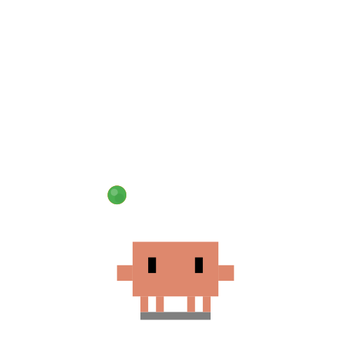

# squib

<p align="center">
  
  &nbsp;
  
  &nbsp;
  
  &nbsp;
  
  &nbsp;
  
  &nbsp;
  
  &nbsp;
  
</p>

A macOS desktop companion that watches your coding agents. Inspired by [clawd-on-desk](https://github.com/rullerzhou-afk/clawd-on-desk).

A small character (Clawd) sits on your screen and reacts to what your AI coding agents are doing — typing when they write code, thinking when they reason, sleeping when idle. Permission requests float up as Liquid Glass cards you can approve with a keypress.

## Features

- **Companion pet** — SVG character with eye tracking in idle state
- **Agent awareness** — reacts to Claude Code, opencode, and pi-mono via hook events
- **Permission bubbles** — Liquid Glass (`NSGlassEffectView` + SwiftUI) floating cards for Claude Code permission requests
  - `⌘⇧Y` allow · `⌘⇧N` deny · `⌘⇧A` trust session (auto-approves future requests)
- **12 states** — idle, thinking, working, building, juggling, conducting, error, attention, notification, sweeping, carrying, sleeping
- **Multi-session** — tracks concurrent agent sessions with priority-based state resolution

## Requirements

- macOS 26+ (Liquid Glass requires `NSGlassEffectView`)
- Swift 6 + SPM

## Running

```bash
swift run squib
```

On first launch, squib writes its hooks into `~/.claude/settings.json` automatically.

## Running Tests

Tests use Swift Testing and run via a standalone executable (not `swift test`):

```bash
swift run squibTestRunner
```

Expected output ends with:
```
✔ Test run with 78 tests in 6 suites passed after 0.430 seconds.
```

## Test Structure

All tests live in `Sources/squibTestRunner/` and import `SquibCore` directly.

| Suite | File | Tests |
|---|---|---|
| `PetState` | `PetStateTests.swift` | Priority ordering, asset extensions, eye tracking, `from(hookEventName:)` mapping |
| `StateEngine` | `StateEngineTests.swift` | Session lifecycle, priority resolution, subagent counting, notification state, `reset()`, `sessionSnapshot`, callbacks |
| `HookParser` | `HookParserTests.swift` | HTTP request parsing, permission payload parsing, response serialisation |
| `PiJSONLParser` | `PiJSONLParserTests.swift` | JSONL line parsing, role mapping, stop reason handling |
| `HookServer Integration` | `HookServerIntegrationTests.swift` | Health check, event dispatch, bad JSON → 400, StateEngine wiring, 404, debug routes |
| `PiWatcher Integration` | `PiWatcherIntegrationTests.swift` | New file → SessionStart, JSONL parsing, appended lines, non-.jsonl ignored |

## Acknowledgments

Clawd pixel art reference from [clawd-on-desk](https://github.com/rullerzhou-afk/clawd-on-desk) by [@rullerzhou-afk](https://github.com/rullerzhou-afk), originally inspired by clawd-tank by [@marciogranzotto](https://github.com/marciogranzotto). Shared on LINUX DO community.

## License

Source code is licensed under the [MIT License](LICENSE).

The artwork (`Sources/squib/Resources/`) is **not** covered by the MIT License. All rights reserved by their respective copyright holders.

- Clawd is the property of Anthropic. This is an unofficial fan project, not affiliated with or endorsed by Anthropic.
- Third-party contributions: copyright retained by respective artists.

---

## Why a standalone runner?

`swift test` uses a bundle runner that only activates Swift Testing when `Testing` is a
formal package dependency (i.e. pulled from a Swift package URL). Since the CLI tools ship
`Testing.framework` at a non-standard path and we link it via `unsafeFlags`, SPM never passes
`--testing-library swift-testing` to the runner, so zero tests execute.

The workaround: `squibTestRunner` is a regular executable target that calls
`Testing.__swiftPMEntryPoint()` directly. The `@Test` and `@Suite` macros register tests into
a global list at load time; the entry point discovers and runs them all.

## Architecture

```
Sources/
  SquibCore/          — library: pure logic, no AppKit (fully testable)
    StateEngine.swift
    HookParser.swift
    PiJSONLParser.swift
    HookServer.swift
    PiWatcher.swift
    PetState.swift
    HookEvent.swift
    PermissionRequest.swift
    PermissionDecision.swift
  squib/              — executable: AppKit app, depends on SquibCore
    AppDelegate.swift
    PetWindow.swift
    PetView.swift
    ...
  squibTestRunner/    — executable: test runner, depends on SquibCore
    main.swift        — Testing.__swiftPMEntryPoint() entry point
    *Tests.swift      — one file per suite
```
